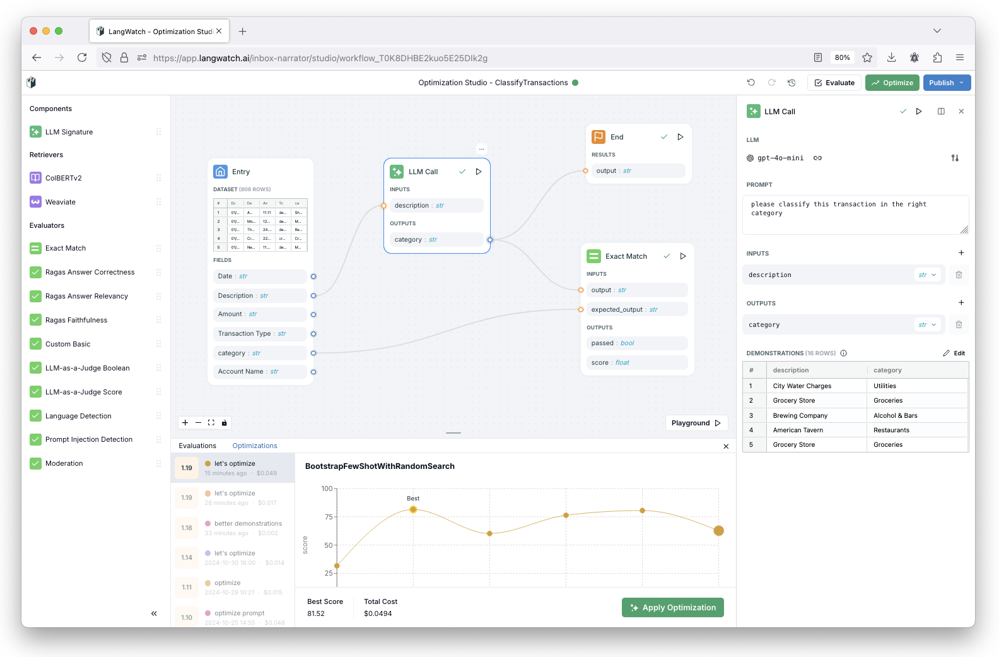

# LangWatch 🏰

<p align="center">
  <picture>
    <source media="(prefers-color-scheme: dark)" srcset="assets/dark.svg">
    <source media="(prefers-color-scheme: light)" srcset="assets/light.svg">
    
  </picture>
</p>

<p align="center">
  <strong>Observe, Evaluate & Optimize your LLM performance</strong>
  LangWatch is an end-to-end evaluation and observability platform, helping teams ship their AI agents reliably and <strong>>8x faster!</strong>
</p>

<p align="center">
  <a href="https://app.langwatch.ai/">Get started (free!)</a> |
  <a href="https://docs.langwatch.ai/">Documentation</a> |
  <a href="https://docs.langwatch.ai/langevals/documentation/introduction">LangEvals Documentation</a>
</p>

Welcome to LangWatch, the all-in-one <strong>open-source</strong> LLMops platform

LangWatch allows you to track, monitor, guardrail and evaluate your LLMs apps for measuring quality and alert on issues.

For domain experts, it allows you to easily sift through conversations, see topics being discussed and annotate and score messages for improvement in a collaborative manner with the development team.

For developers, it allows you to debug, build datasets, prompt engineer on the playground and run batch evaluations or [DSPy experiments](https://docs.langwatch.ai/dspy-visualization/quickstart) to continuously improve the product.

Finally, for the business, it allows you to track conversation metrics and give full user and quality analytics, cost tracking, build custom dashboards and even integrate it back on your own platform for reporting to your customers.

<p align="center">
  <picture>
    
  </picture>
</p>

You can sign up and already start the integration on our free tier by following the guides bellow:

## 🎬 Getting Started

- 📚 Read the [Documentation](https://docs.langwatch.ai/introduction) for 
- 💻 Use our SDKs to start building:
  - [TypeScript SDK](https://docs.langwatch.ai/integration/python/guide)
  - [Python SDK](https://docs.langwatch.ai/integration/typescript/guide)
  - [REST API](https://docs.langwatch.ai/integration/rest-api)

Language of choice missing? [📧 Email us](mailto:support@langwatch.ai), or [💬 join our Discord](https://discord.gg/kT4PhDS2gH) and let us know!

### Getting running

1. Clone the relevant repository
- ```bash
  git clone https://github.com/langwatch/langwatch.git
  ```
- ```bash
  # or if you use the GitHub CLI
  gh repo clone langwatch/langwatch
  ```
2. Follow the documentation for setup and usage
3. Contribute by opening issues, submitting pull requests, or discussing ideas.

## 🔑 Key projects

- [LangWatch](https://github.com/langwatch/langwatch) The core platform for LLM Ops, integrating monitoring, analytics, and optimization tools.
- [LangEvals](https://github.com/langwatch/langevals) A unified framework for evaluating language models, aggregating multiple scoring methods and LLM guardrails.
- [Docs](https://github.com/langwatch/docs) Comprehensive documentation to help users set up and utilize LangWatch tools.

## 🎸 Demo

[📺 Short video (3 min)](https://www.youtube.com/watch?v=dZG44oRTz84) for a sneak peak of LangWatch and a brief introduction to the concepts.

## 🤝 Contributing

Contributions are what make the open-source community such an amazing place to learn, inspire, and create. Any contributions you make are **greatly appreciated**.

Please read our [Contribution Guidelines](https://github.com/langwatch/langwatch/blob/main/CONTRIBUTING.md) for details on our code of conduct, and the process for submitting pull requests.

## 🛟 Support

If you have questions or need help, join our community:

- [Discord Community](https://discord.gg/kT4PhDS2gH)
- [Documentation](https://docs.langwatch.ai)
- [Email Support](mailto:support@langwatch.ai)
